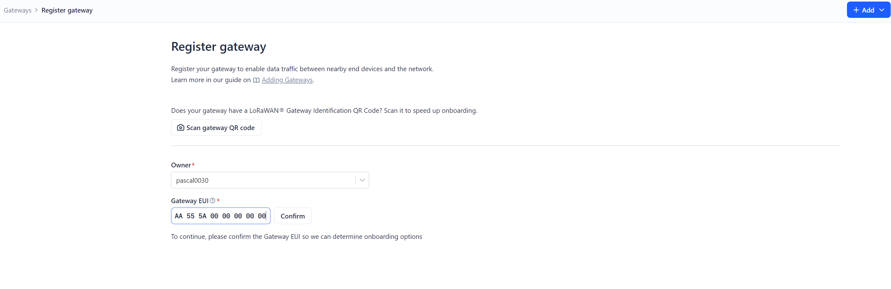

# Rasperry Pi Lorawan SX1302 LoRaWAN Gateway HAT in Docker
[SX1303 868M LoRaWAN Gateway Module/HAT for Raspberry Pi](https://www.pi-shop.ch/sx130x-868m-915m-lorawan-gateway-module-hat-for-raspberry-pi)

**Disclaimer**\
This Documentation and the Docker Image follow the linked Documentation in the Product ([SX1302 LoRaWAN](https://www.waveshare.com/wiki/SX1302_LoRaWAN_Gateway_HAT)).\
This Docker Image is used to simplify the Installation and use of the gateway.

***IMPORTANT NOTE:***
- The `reset_lgw.sh` (provided script for the raspberry pi 4b installation `https://github.com/Lora-net/sx1302_hal.git`) script relies on the old sysfs GPIO interface, which is no longer available in Raspberry Pi OS Bookworm. Instead, Bookworm uses libgpiod (gpioset, gpioget, etc.).
I got some Problems on installing the raspberrypi4 target system
> However i have managed to run this Docker Image (targets Raspberry Pi 5) in a Docker Container on a Raspberry Pi 3 successfully.

- The GPS Module also does not work inside the docker-image. Currently i have no clue what the problem could be.
> Feel free to contribute to this project.

## Preparations to run the Docker-Image
 `sudo raspi-config` \
Go to "***Interface Options***"
- Enable SPI
- Enable I2C
- Enable GPIO access
> Reboot the Device

### 1.1 Get the EUI-Number
Start the Docker Container the first time after mounting the HAT.
The Container will crash but shows you the `EUI-Number` to register the device in [The Things Network](https://eu1.cloud.thethings.network).
> The EUI-Number should have following format: `AA555A0000000000`

```bash
docker run --privileged \
-e DEBUG=1 \
ghcr.io/pascal0030/lorawan-gateway-sx1302:latest
```

### 1.2 Register your device in The Things Network
- Open [The Things Network Console](https://eu1.cloud.thethings.network/console) in a browser and create a new gateway with the EUI-Number from the previous step.

- Go to your created gateway and download the `global_conf.json` file from the website.
- Store the downloaded file on the raspberry pi under `/opt/docker/lorawan-gateway/global_conf.json`


## Run the Docker Image
### 2. Run the Lorawan Gateway with the provided global_conf.json file - VARIANT 1
Start the gateway with following command.
There is no need to modify the downloaded file like the documentation [SX1302_LoRaWAN_Gateway](https://www.waveshare.com/wiki/SX1302_LoRaWAN_Gateway_HAT) describes.
\-> The Docker Image does the required modification itself.
```bash
docker run -d --restart always --privileged \
-v /opt/docker/lorawan-gateway/global_conf.json:/opt/docker/lorawan-gateway/global_conf.json:ro \
ghcr.io/pascal0030/lorawan-gateway-sx1302:latest
```

### 3. Run the Lorawan Gateway with ENV Variables - VARIANT 2
Define following **ENV Variables** and start the Docker Image.
You can find the Values in the downloadad `global_conf.json` file from **[1.2](#12-register-your-device-in-the-things-network)**

| ENV Variable       | Description | Required and Optional |
| ------------------ | ----------- | :---------------------: |
ENV SERVER_ADDRESS | The Server address to connect to.<br> Defaults to `eu1.cloud.thethings.network`. | `[optional]`
ENV SERVER_PORT_UP | The Server UDP UP-Port. Defaults to `1700`. | `[optional]`
ENV SERVER_PORT_DOWN | The Server UDP-DOWN Port. Defaults to `1700`. | `[optional]`
DEBUG | Use this Flag to determine the EUI-Number.<br> Can be `1` or `0`. Defaults to `0`. | `[optional]`


```bash
docker run -d --restart always --privileged \
-e SERVER_ADDRESS=eu1.cloud.thethings.network \
-e SERVER_PORT_UP=1700 \
-e SERVER_PORT_DOWN=1700 \
ghcr.io/pascal0030/lorawan-gateway-sx1302:latest
```


## Build/Modify the Lorawan Gateway Image
If you want to build and modify this Docker Image, follow the steps below.

### 4. Checkout the Repository
```bash
cd ~/github
git clone https://github.com/pascal0030/lorawan-gateway-sx1302.git
cd lorawan-gateway-sx1302/lorawan-gateway
```

### 5. Build the Docker Image
Chose the targe build system: `raspberrypi4` or `raspberrypi5`\
***Syntax:*** `docker buildx build --target <Target-Build-System> -t lorawan-gateway .` 

Example build command:
```bash
docker buildx build --target raspberrypi5 -t lorawan-gateway .
```

### 6. Use this Command to debug/test the Docker Image
```
docker run -it --rm --privileged \
lorawan-gateway /bin/bash
```

### Feel free to contribute
Feel free to contribut and share the code with your friends.

## sources
[SX1302 LoRaWAN Gateway HAT](https://www.waveshare.com/wiki/SX1302_LoRaWAN_Gateway_HAT#Introduction)