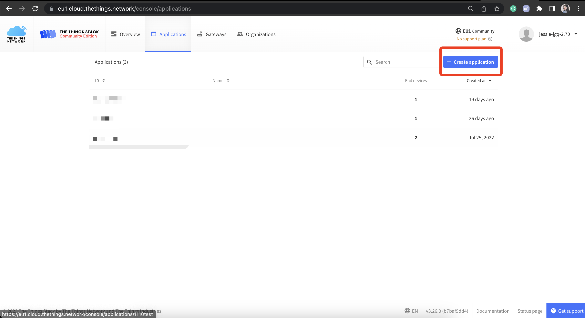
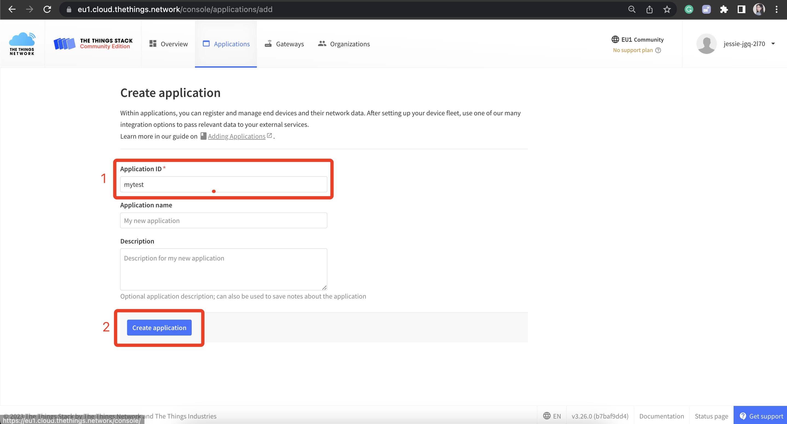
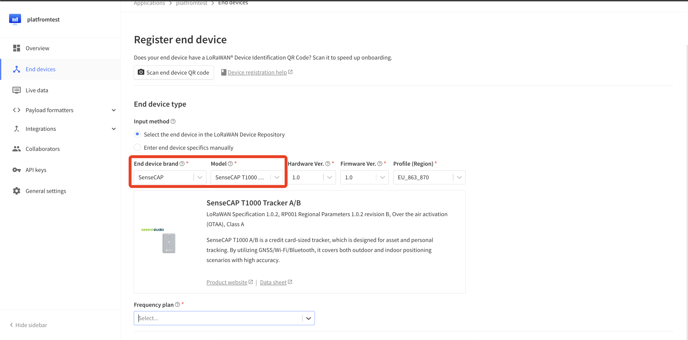
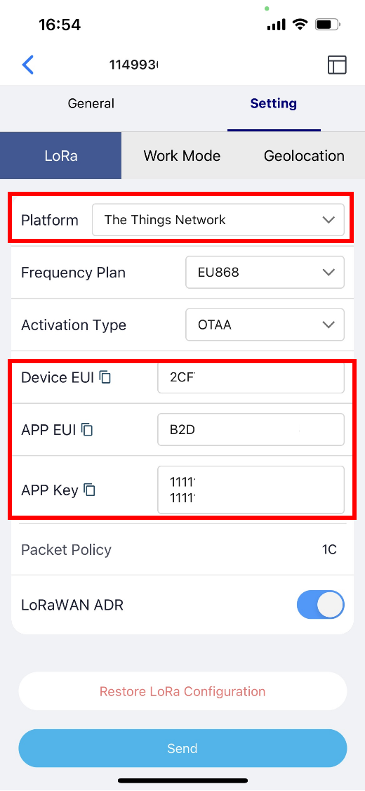
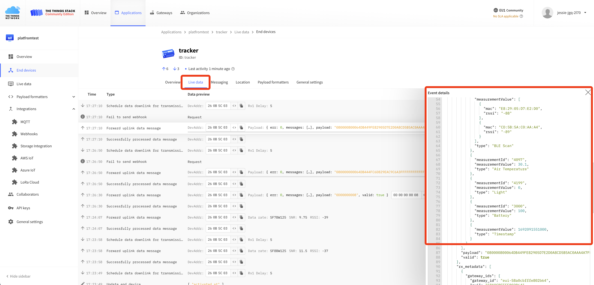

# Register a LoraWAN Node

## Step 1: Create an application
Navigate to Applications page, click "+Create application".

Enter an Application ID, click Create Application to save your changes.

## Step 2: Register the Device
Select the frequency plan according to your device.

Paste the Device EUI/APP EUI/APP Key from the SenseCraft App, and then click Register end device.
> **NOTE: The "JoinEUI" above is simliar to "AppEUI".**

TTN           |  Node
:-------------------------:|:-------------------------:
 |  

## Step 3: Check the data
When the device tries to connect to the network, the breathing light will flash. If the device joins the network successfully, the breathing light will flash quickly, and there will be a light and cheerful melody.

Then you can check the data on the TTS console.

### sources
[Connect Node to TTN](https://wiki.seeedstudio.com/SenseCAP_T1000_tracker_TTN/#step-2-register-the-device=)